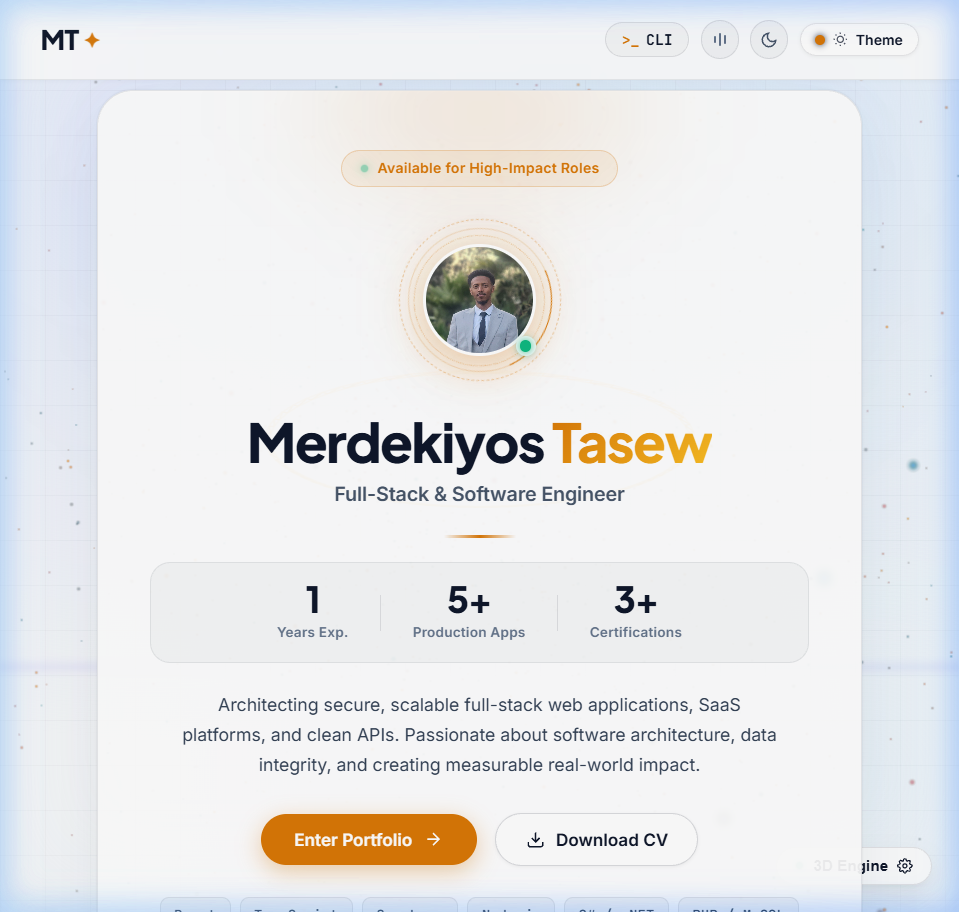
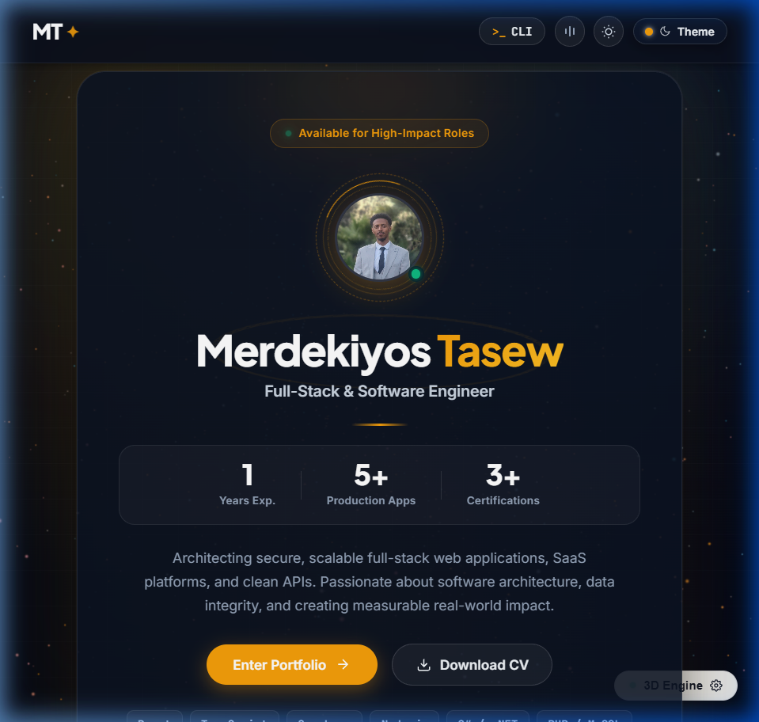
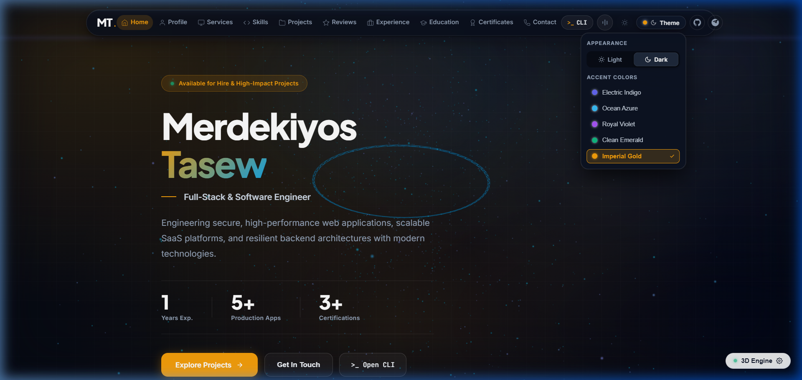
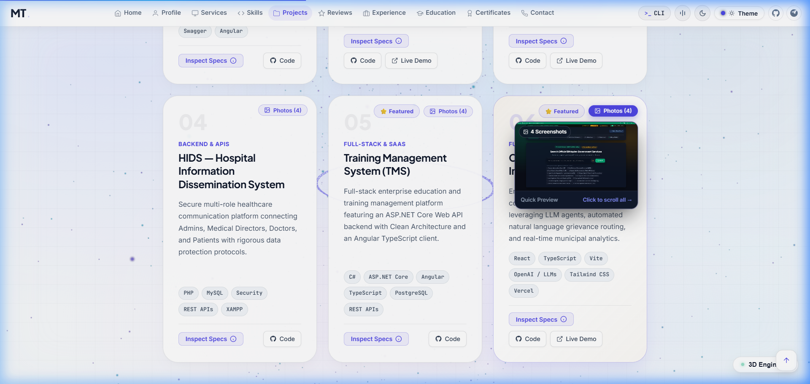
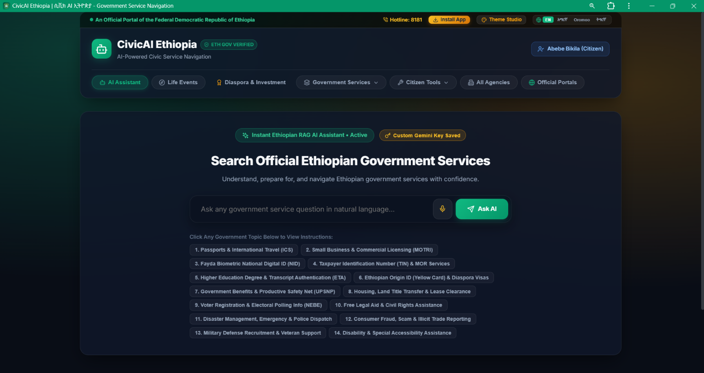
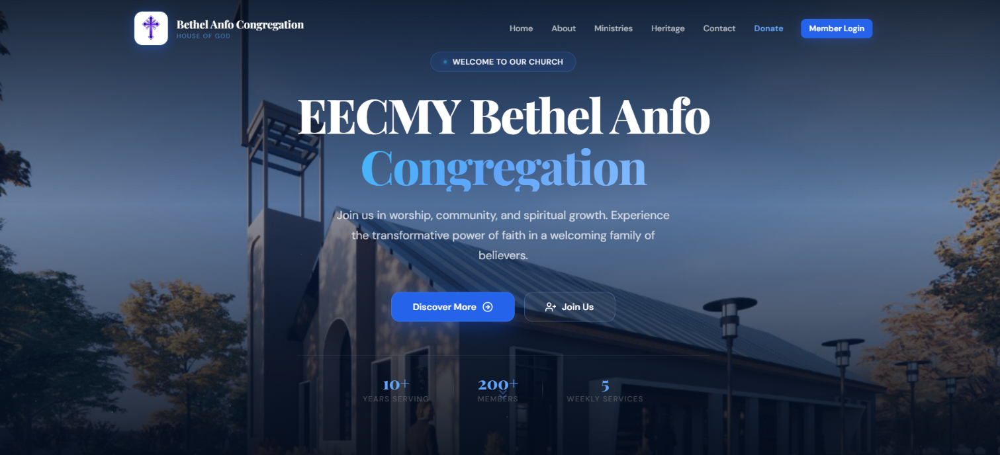
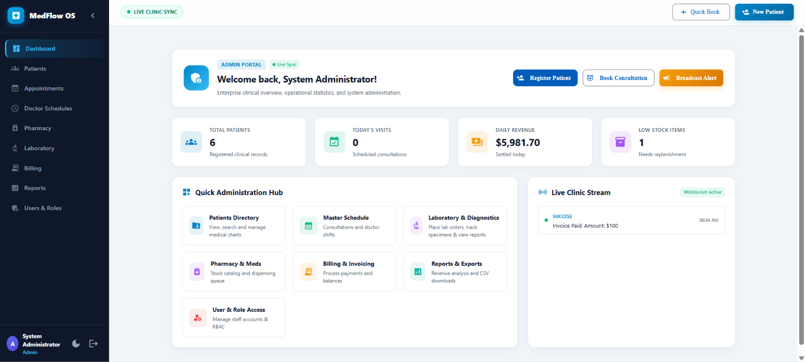
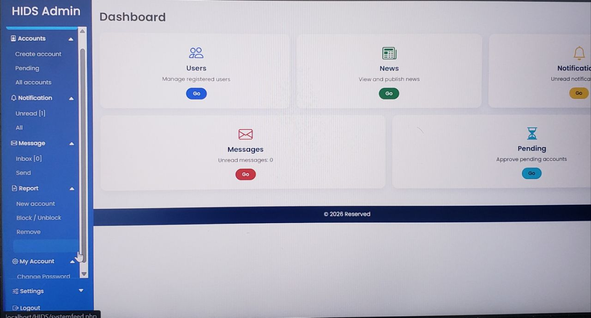
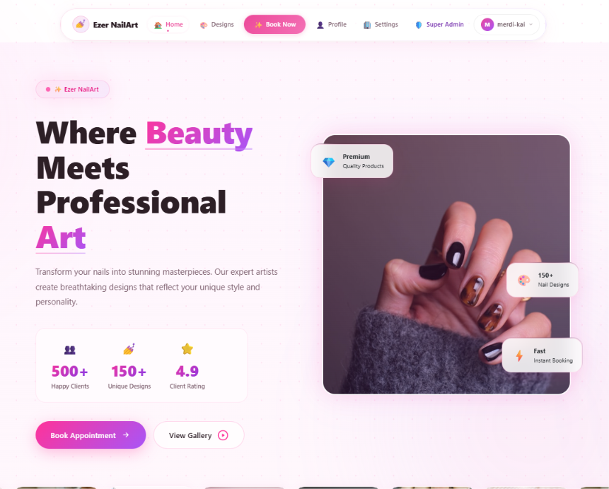
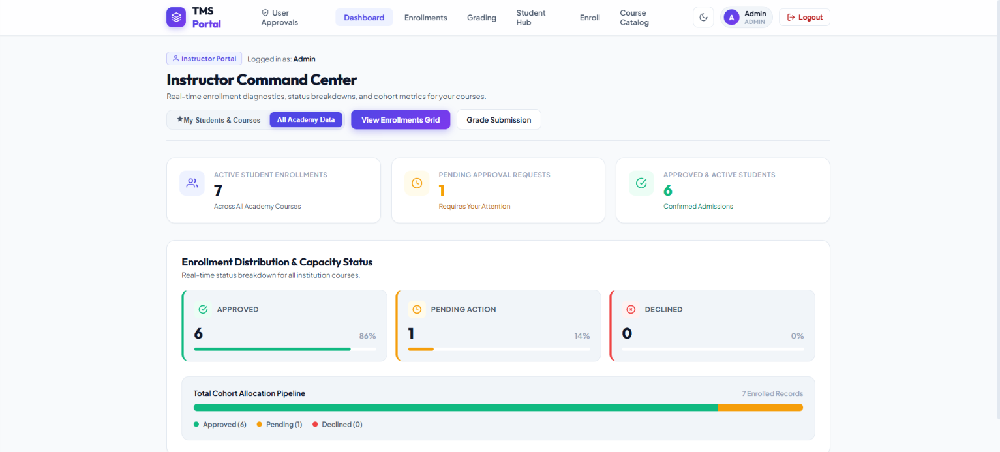

<div align="center">

  # ⚡ Merdekiyos Tasew — Engineering Portfolio

  **Senior-Caliber Full-Stack & Software Engineer**  
  *Crafting bulletproof web applications, high-throughput backend architectures, and elegant user interfaces.*

  <br />

  [](https://react.dev/)
  [](https://www.typescriptlang.org/)
  [](https://vitejs.dev/)
  [](https://threejs.org/)
  [](LICENSE)

  <br />

  [🌐 **Explore Portfolio**](https://merdekiyos-tasew.vercel.app/) •
  [💼 **LinkedIn**](https://linkedin.com/in/merdekiyos-tasew) •
  [💬 **Telegram**](https://t.me/Merdi27) •
  [✉️ **Email**](mailto:merdekiyostasew@gmail.com)

</div>

---

## 🌟 Visual Showcase

<div align="center">
  <h3>✨ The Modern Landing Experience (Light & Dark Mode)</h3>
  <p>Engineered with dynamic 3D holographic avatar rings, ambient light gradients, and kinetic typography.</p>
</div>

| ☀️ Light Mode (Imperial Gold) | 🌙 Dark Mode (Imperial Gold) |
| :---: | :---: |
|  |  |

<br />

<div align="center">
  <h3>🚀 Main Engineering Portfolio</h3>
  <p>Deep-dive architecture view featuring interactive 3D particle constellations, dynamic skill meters, client testimonials, and credentials.</p>
  
</div>

<br />

<div align="center">
  <h3>🖼️ Interactive Photo Thumbnail Hover Preview</h3>
  <p>Hovering over any project's <strong>Photos</strong> button instantly reveals an authentic floating mini screenshot snapshot of the application with quick slide controls.</p>
  
</div>

---

## ⚡ Key Highlights & Architecture

- **🎨 5 Dynamic Brand Accents**: Switch between *Electric Indigo*, *Ocean Azure*, *Royal Violet*, *Clean Emerald*, and *Imperial Gold*. All styles adapt seamlessly in real time across the entire application.
- **🌓 Dual Mode Ecosystem**: Full Light and Dark mode support built with curated HSL color tokens, rich glassmorphic layers, and zero flicker.
- **🖼️ Multi-Screenshot Project Galleries**: Every featured project includes high-resolution application screenshots, live demo links, and GitHub source references.
- **💻 Embedded Hacker Terminal (`>_`)**: Built-in interactive CLI drawer providing power users with commands like `help`, `projects`, `skills`, `contact`, `theme`, `clear`, and `exit`.
- **⭐ Authentic Client Testimonials & Review Engine**: Real verified client reviews with an interactive review submission modal, client rating calculator, and celebratory particle confetti.
- **🎵 Synthesized Audio Feedback**: Subtle, non-intrusive sound effects for button clicks, switches, and modal interactions (with a 1-click mute toggle).
- **🌌 Dynamic 3D Constellation Engine**: Built with Three.js to render an interactive physics-based particle field that responds to user cursor movement.
- **🛡️ Strict Type Safety & Clean Code**: 100% TypeScript, strict compiler options (`verbatimModuleSyntax`, `noUnusedLocals`), and 0 ESLint warnings.

---

## 💼 Featured Production Projects

<table align="center" width="100%">
  <tr>
    <td width="50%" valign="top">
      
      <h3>🏛️ CivicAI — Civic Engagement & Policy AI</h3>
      <p>An intelligent platform connecting citizens with municipal data, legislative tracking, and AI-driven policy summarization.</p>
      <b>Tech:</b> React, TypeScript, Python FastAPI, LLM Embeddings, TailwindCSS
    </td>
    <td width="50%" valign="top">
      
      <h3>⛪ Bethel Anfo EECMY Church Management</h3>
      <p>Comprehensive administrative software handling member records, ministry scheduling, financial contributions, and SMS broadcasting.</p>
      <b>Tech:</b> React, Node.js, Express, PostgreSQL, Prisma, JWT Auth
    </td>
  </tr>
  <tr>
    <td width="50%" valign="top">
      
      <h3>🏥 MedFlow Clinic Management Platform</h3>
      <p>End-to-end healthcare management suite featuring patient EHR, doctor scheduling, electronic prescription generation, and billing.</p>
      <b>Tech:</b> React, TypeScript, Supabase, PostgreSQL, Role-Based Access Control
    </td>
    <td width="50%" valign="top">
      
      <h3>🛡️ Real-Time Host Intrusion Detection (HIDS)</h3>
      <p>Cybersecurity monitoring daemon tracking file integrity violations, unauthorized process spawns, and abnormal network traffic.</p>
      <b>Tech:</b> Python, Scapy, SQLite, Linux Audit Framework, Threat Intel Feeds
    </td>
  </tr>
  <tr>
    <td width="50%" valign="top">
      
      <h3>💅 Ezer Nail Salon & Spa Booking Engine</h3>
      <p>High-converting client booking application with real-time technician calendar management, automated reminders, and review management.</p>
      <b>Tech:</b> React, Vite, Node.js, Webhooks, CSS Modules
    </td>
    <td width="50%" valign="top">
      
      <h3>🎓 Enterprise Training Management System (TMS)</h3>
      <p>SaaS platform organizing corporate curriculum tracks, trainee progress metrics, automated certificate issuance, and instructor grading.</p>
      <b>Tech:</b> React, TypeScript, REST APIs, Chart.js, PDF Generation
    </td>
  </tr>
</table>

---

## 🛠️ Technology Stack

```
Frontend Architecture ──► React 19 · TypeScript 5.9 · Vite 8 · React Router 7
Styling & Design      ──► Vanilla CSS Custom Properties · Glassmorphism · CSS Grid & Flexbox
Interactive 3D & Math ──► Three.js · Canvas Confetti · 3D Parallax Tilt Cards
Audio & Sound Engine  ──► Web Audio API Synthesizer
Code Quality          ──► ESLint 9 · TypeScript Strict Mode (Zero Errors)
Deployment & CI/CD    ──► Vercel · Git Version Control
```

---

## 🚀 Getting Started Locally

Follow these steps to run the portfolio on your local machine:

### 1. Clone the Repository
```bash
git clone https://github.com/Merdikai/Merdekiyos-Tasew-Portofolio.git
cd Merdekiyos-Tasew-Portofolio
```

### 2. Install Dependencies
```bash
npm install
```

### 3. Start Development Server
```bash
npm run dev
```
Open your browser at `http://localhost:5173` to explore the live application.

### 4. Build for Production
```bash
npm run build
```

### 5. Run Quality / Lint Checks
```bash
npm run lint
```

---

## 📂 Project Structure

```
├── public/
│   ├── images/
│   │   ├── previews/          # High-resolution portfolio & gallery previews
│   │   ├── projects/          # Screenshots for all production projects
│   │   └── avatars/           # Verified testimonial client avatars
│   ├── cv.pdf                 # Downloadable Curriculum Vitae
│   └── merdi.jpg              # Developer profile photo
├── src/
│   ├── assets/                # Vector icons and graphics
│   ├── components/            # Modular React components
│   │   ├── Header.tsx         # Responsive navbar, audio toggle, and quick theme switch
│   │   ├── Footer.tsx         # Social links, brand mark, and back-to-top button
│   │   ├── ProjectModal.tsx   # Glassmorphic screenshot carousel gallery
│   │   ├── ReviewModal.tsx    # Interactive client testimonial submission modal
│   │   ├── TerminalDrawer.tsx # Embedded interactive CLI terminal
│   │   ├── ThemeSwitcher.tsx  # Dynamic 5-color accent & dark/light mode controller
│   │   ├── ThreeBackground.tsx# Three.js dynamic particle constellation canvas
│   │   ├── TiltCard.tsx       # Physics-based 3D tilt card container
│   │   └── ContactForm.tsx    # Interactive direct message contact form
│   ├── pages/
│   │   ├── Landing.tsx        # High-impact introduction page with 3D avatar rings
│   │   └── Portfolio.tsx      # Comprehensive single-page engineering portfolio
│   ├── utils/
│   │   ├── theme.ts           # Centralized theme tokens, palettes & DOM synchronization
│   │   └── soundEffects.ts    # Web Audio API procedural sound engine
│   ├── darkTheme.css          # Scoped CSS overrides for dark mode aesthetic
│   ├── index.css              # Global design system, typography & CSS variables
│   └── main.tsx               # Application entry point with React Router
└── package.json
```

---

## 📬 Contact & Connect

Feel free to connect for software engineering opportunities, consulting, or technical collaborations:

- **Full Name**: Merdekiyos Tasew
- **Location**: Addis Ababa, Ethiopia
- **Email**: [merdekiyostasew@gmail.com](mailto:merdekiyostasew@gmail.com)
- **Phone**: [+251 953 913 418](tel:+251953913418)
- **LinkedIn**: [linkedin.com/in/merdekiyos-tasew](https://linkedin.com/in/merdekiyos-tasew)
- **GitHub**: [@Merdikai](https://github.com/Merdikai)
- **Telegram**: [@Merdi27](https://t.me/Merdi27)

---

<div align="center">
  <sub>Designed &amp; Built with ❤️ by Merdekiyos Tasew · Licensed under MIT</sub>
</div>
